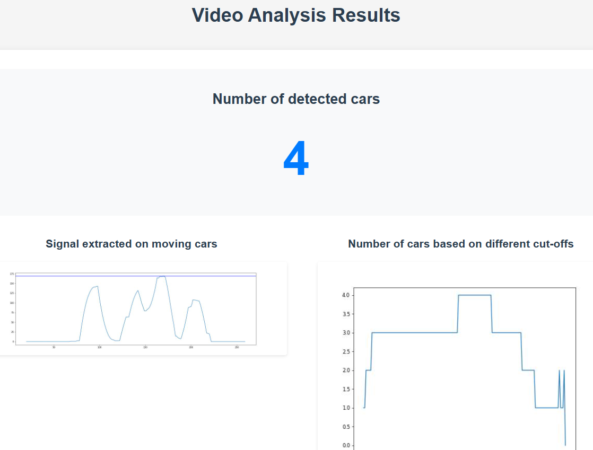

# CountingCars
Computer vision application to turn any smartphone video into a traffic survey tool

Below is the result of processing a video with multiple overlapping cars coming in and out of shot, filtering out parked cars

The app works by tracking coordinates of cars through time, filtering out stationary ones, and converting any moving car into a one-dimensional signal which represents the movement of cars, from which the number of moving cars in the video can be estimated using statistical methods

